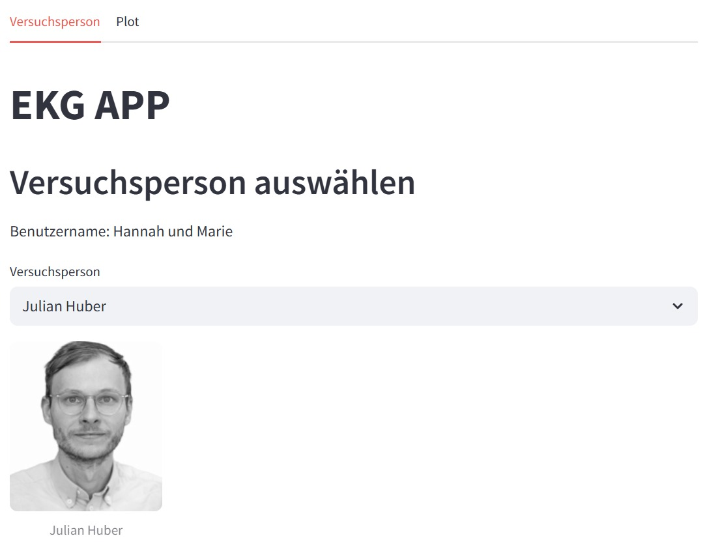
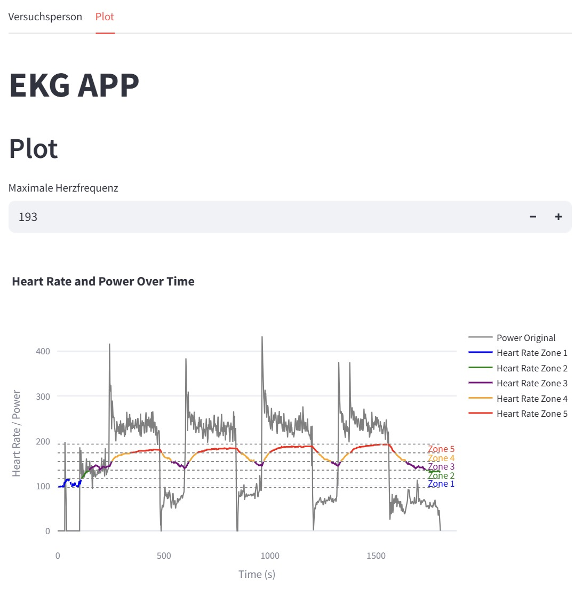
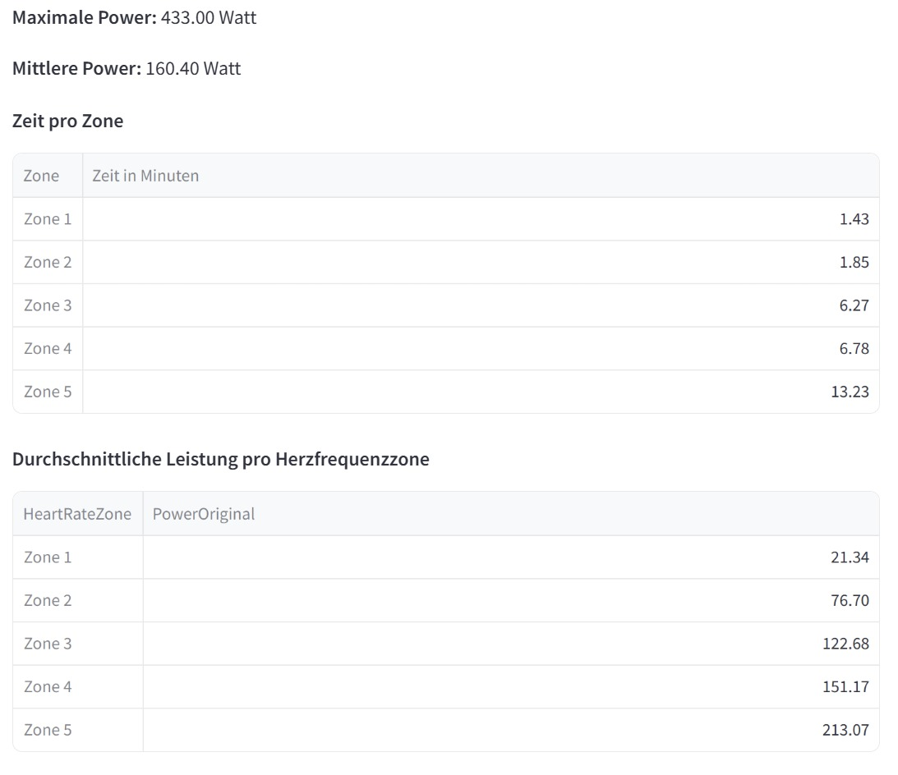
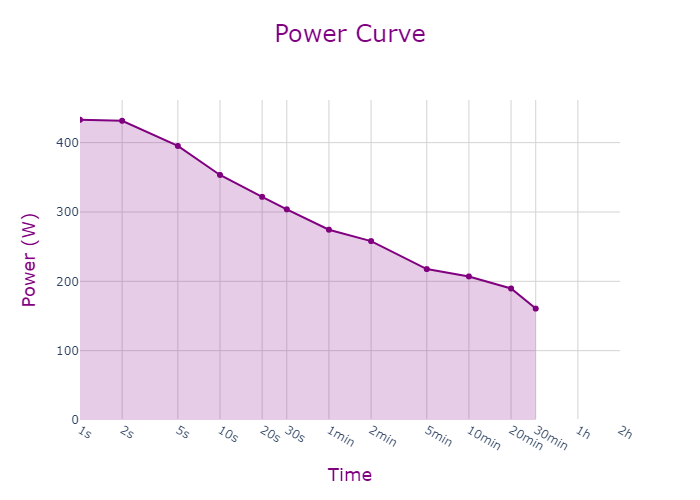

# programmieruebung_Auf_2-5
# 🧠 EKG-Auswertungs-App

Diese interaktive App dient der Visualisierung und Analyse von EKG- und Leistungsdaten in sportwissenschaftlichen Kontexten. Entwickelt mit Streamlit, ermöglicht sie die Auswahl von Versuchspersonen, die Anzeige individueller Messdaten sowie die Auswertung von Herzfrequenzzonen.

---

## 🔧 Voraussetzungen

### 📦 Installation mit PDM

1. 📥 Projekt-Repository klonen:
    1. Kopiere die Https-Adresse des Repositories über den grünen Code-Button auf GitHUb
    2. Öffne den Zielordner auf deinem Rechner, öffne dort die GitBash und gib den Befehl `git clone <Https-Link>´ ein 
    3. Öffne den geklonten Ordner anschließend in Visual Studio Code 

2. 📦 Abhängigkeiten installieren:
    1. Öffne die Powershell oder ein Terminal im Projektordner und führe den Befehl `pdm install´ aus, dadurch werden alle notwendigen Pakete automatisch installiert 

    Wichtig: Stelle sicher, dass PDM bereits auf deinem System installiert ist

---

## 🚀 Anwendung 
1. Anwendung starten 
    1. Starte die App in der Powershell oder einem Terminal mit dem Befehl `streamlit run main.py´
    2. Die App öffnet sich automatisch im Browser unter der Adresse http://localhost:8501

---

## 🧭 Projektstruktur

```
├── data/
│   ├── activities/
│   │   └── activity.csv            # Messdaten (Herzfrequenz, Leistung)
│   ├── pictures/
│   │   └── <personenbilder>.jpg    # Fotos der Versuchspersonen
│   └── personen.csv                # Metadaten (Name, Bildpfad etc.)
├── read_data.py                    # Datenzugriff: Personenliste, Bildpfade
├── read_pandas.py                  # Datenanalyse, Zonenberechnung, Plots
├── main.py                         # Streamlit-GUI der App
└── README.md                       # Diese Datei
```

---

## ⚙️ Funktionen der App

- Auswahl einer Versuchsperson inkl. Bildanzeige
- Anzeige von Herzfrequenz & Leistung über die Zeit
- Automatische Einteilung der Herzfrequenz in Zonen
- Eingabe oder automatische Erkennung der maximalen Herzfrequenz
- Auswertung:
  - maximale und durchschnittliche Leistung
  - durchschnittliche Leistung in jeder Herzfrequenzzone
- Interaktive Diagramme mit Plotly

---

## 🧪 Beispielnutzung

1. Starte die App mit `streamlit run main.py`
2. Wähle eine Versuchsperson aus
3. Überprüfe oder passe die maximale Herzfrequenz an
4. Analysiere:
   - Herzfrequenz-/Leistungskurven
   - farbige Zonenmarkierung im Diagramm
   - statistische Kennzahlen pro Zone

---

## 👩‍🔬 Zielgruppe

Diese Anwendung richtet sich an:
- Sportwissenschaftler:innen
- Trainer:innen
- Studierende in Projekten zur Leistungsdiagnostik

## 🖼 Beispielbilder aus der Anwendung

Hier siehst du beispielhafte Screenshots der App:

### 👤 Versuchsperson-Auswahl


### 📊 Diagramm mit Herzfrequenzzonen



### 📈 Statistische Auswertung


# ⚡ Power_Curve: Leistungsanalyse über Zeitfenster

## ⚠️ Zusätzliche Voraussetzungen

Für das Speichern des Plots als Bild (z. B. PNG) wird das Paket `kaleido` benötigt.

## 🔧 Funktionen

- **Einlesen der Leistungsdaten** aus einer CSV-Datei
- **Analyse der maximalen durchschnittlichen Leistung** für definierte Zeitfenster (z. B. 10 s, 1 min, 5 min, …)
- **Erstellung eines neuen DataFrames**, das die Ergebnisse übersichtlich enthält
- **Visualisierung als Plot** mit Plotly
- **Speicherung des Plots als `.png`** im Ordner `data/`

## 📊 Ausgabe

- Tabelle mit Fensterlänge (in Sekunden) und maximaler Durchschnittsleistung
- Plot der Leistungskurve als `leistungskurve.png` im Projektverzeichnis (oder Unterordner `data/`)

## Beispielbild aus der Anwendung 
